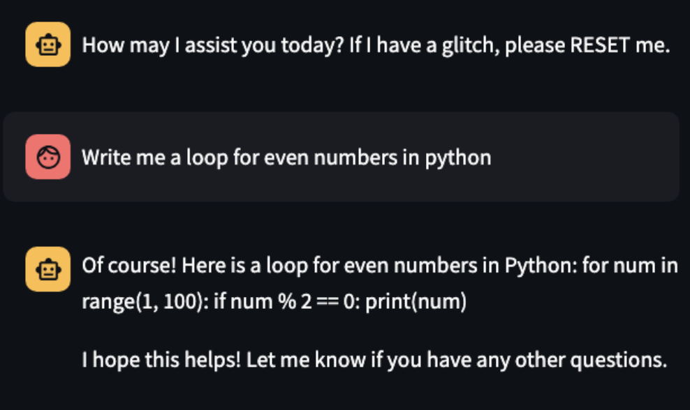
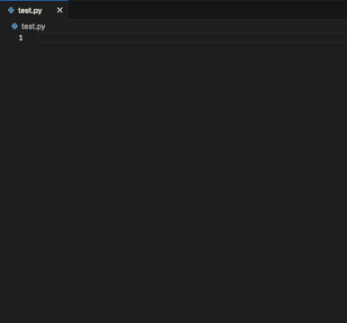

# Fluffy 🦙
## A local LLM pair programming utility

Fluffy is a pair of experimental, generative AI tools designed to explore the effectiveness of utilizing AI for teaching programming at the university level. Fluffy is designed to work with Meta's [Llama 2.](https://ai.meta.com/llama/)

In each subdirectory, you will find more detailed READMEs that outline the purpose of each component of Fluffy. 

**The project is organized as follows:**

## API
`api` is where the REST API that powers Fluffy lives.

## Chatbot
`chatbot` houses the Llama 2-powered Chatbot that we used during evaluation of Fluffy.

## Visual Studio Code Extension
Finally, the `vscode` directory houses the copilot programming VS Code extension created to work with the API and provide users with Llama 2 coding suggestions.

