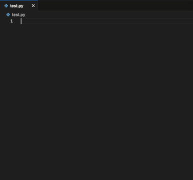

# Fluffy 🦙 VS Code Extension

### Before you begin
- `npm` must be installed. Install the latest version of node.js; it comes bundled with `npm`.
- Make sure the API is running. For information about setting up the API, check `api\README.md`.

### Starting the extension
1. From the project's main directory, open the `llama` folder as a project within VS Code.
2. Within the newly opened VS Code project, open `src\extension.ts`. Press F5 to start the extension. A new VS Code remote development window opens.
3. Use the remote development window to test the extension's functionality.

### Functionality:
* All functionality is tested only for editing Python (`.py`) files in VS Code. Make certain the active editor is focused on a `.py` file in the remote development window when using the extension.

**Suggest Code Completion**

In an active editor, use the cursor to highlight text, such as a function header or definition, to add a code completion from the model. For best results, highlight as much text as is relevant.
